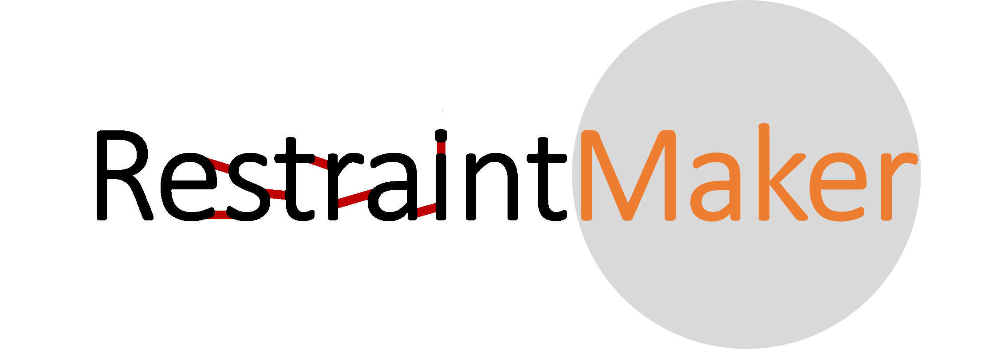

[//]: # (Badges)

# Welcome to RestraintMaker

RestraintMaker is a tool that allows automatic distance restraint assignment for dual-topology relative free energy calculations.
The package can be used either in a scripting mode or with a GUI-based in PyMol. 

**This repository is heavy under development! It will be nicer soon ;)**

## Introduction

## Examples
  coming soon
  
## Content

### Using
  For usage examples, checkout the examples folder.
  
### Development
Restraint make is split two parts.
* RestraintMaker
  This part is the core of the program. It can be executed as standalone.
    * algorithm
    * tools_Rdkit
    * io
    * utils
    
* Interface Pymol
    
## Installation
You can retrieve the repository from GitHub:
https://github.com/rinikerlab/restraintmaker

  * Install via Pymol Plugin Manager **coming soon**

  * Install with Anaconda
   
        #!/usr/bash
        # 1. Retrieve the repository
        git clone https://github.com/rinikerlab/restraintmaker.git
        cd restraintmaker

        # 2. generate an Anaconda environment with the environment file:       
        conda env create --file devtools/conda-envs/dev_env.yaml -n restraintmaker

        # 3. Test    
        conda activate restraintmaker
        python examples/example_gui.py

## Author
Benjamin Ries,
Salomé Rieder
Clemens Rhiner
    
## Acknowledgments
The authors want to thank Carmen Esposito and Dominik Sidler for the great discussions.
Project based on the 
[Computational Molecular Science Python Cookiecutter](https://github.com/molssi/cookiecutter-cms) version 1.3.

## Copyright

Copyright (c) 2021, Benjamin Ries, Salomé Rieder, Clemens Rhiner

