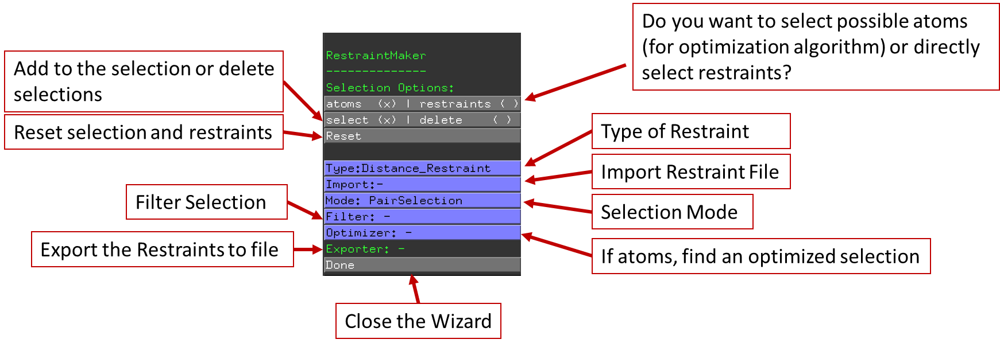
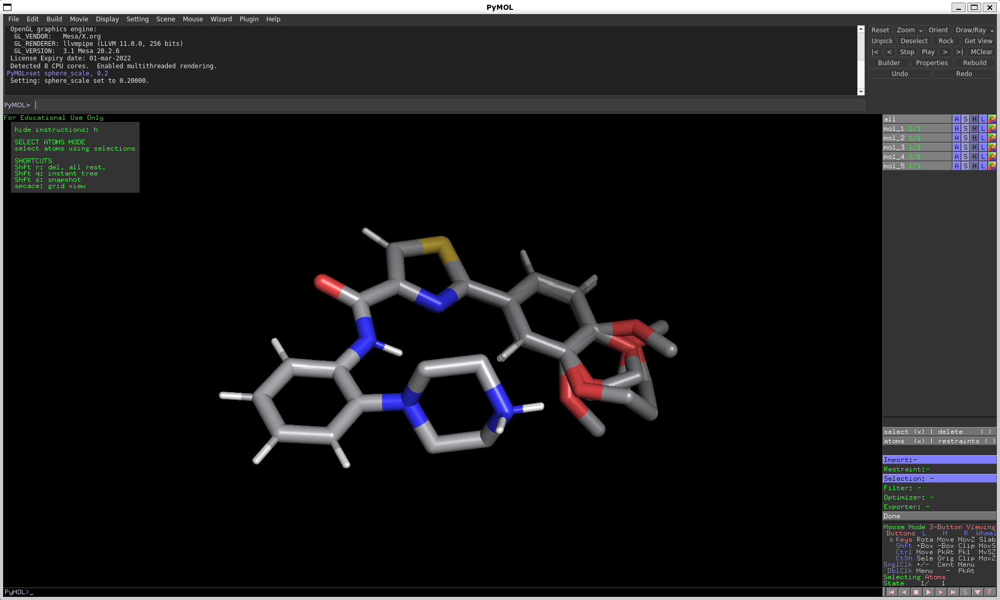
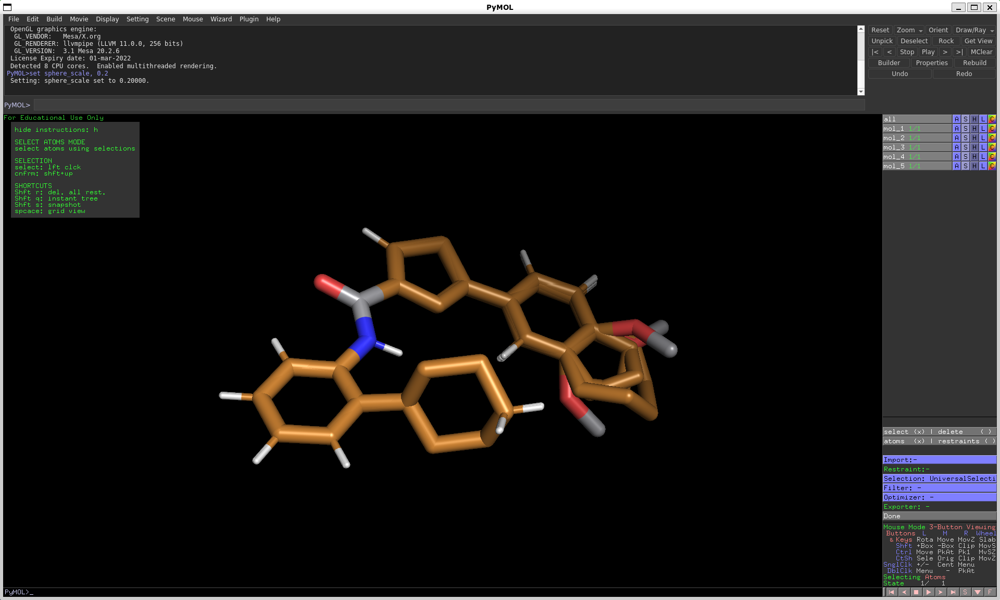
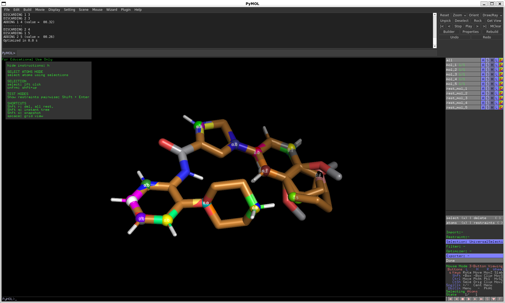
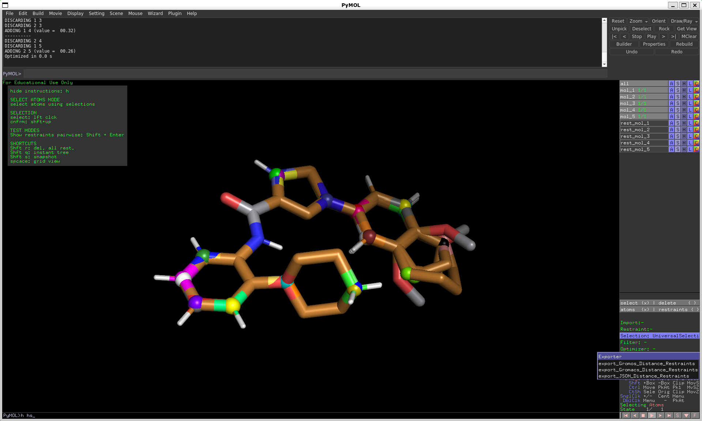

[//]: # (Badges)

# Welcome to RestraintMaker

RestraintMaker is a tool that allows automatic distance restraint assignment for dual-topology relative free energy calculations.
The package can be used either in a scripting mode or with a GUI-based in PyMOL(see [2]). 

**This repository is heavy under development! It will be nicer soon ;)**

## Introduction
  coming soon

## Examples
  coming soon
  
## Content
### Using
  For usage examples, checkout the examples folder.
  
### Development
Restraint make is split two parts.
* RestraintMaker
  This part is the core of the program. It can be executed as standalone.
    * algorithm: restraint selecting algorithms
    * tools_Rdkit: additional functions for filtering or selecting (see [1])
    * io: writing/importing outputfiles
    * utils
    
* Interface PyMOL:
    Allows interfacing to PyMOL and generates the GUI-Expierence (see [2])
    
## Installation
You can retrieve the repository from GitHub:
https://github.com/rinikerlab/restraintmaker

  * Install via Pymol Plugin Manager 
      
      **coming soon**

  * Install with Anaconda
   
        #!/usr/bash
        # 1. Retrieve the repository
        git clone https://github.com/rinikerlab/restraintmaker.git
        cd restraintmaker
        
        # 2. activate submodules
        git submodule init
        git submodule update

        # 3. generate an Anaconda environment with the environment file and add the repository to its path:       
        conda env create --file devtools/conda-envs/dev_env.yaml -n restraintmaker
        conda develop -n restraintmaker /absolute_path/to/restraintmaker

        # 4. Test    
        conda activate restraintmaker
        python examples/example_gui.py

## GUI Tutorial
### GUI Menu

### Optimized Distance Restraints
#### Start by loading

#### Select \& Filter

#### Optimize restraints

#### Export restraints to files

## Author
Benjamin Ries,
Salomé Rieder
Clemens Rhiner
    
## Acknowledgments
The authors want to thank Carmen Esposito and Dominik Sidler for the great discussions.
Project based on the 
[Computational Molecular Science Python Cookiecutter](https://github.com/molssi/cookiecutter-cms) version 1.3.

## References
[1] **RDKit**: **Cheminformatics** and machine learning software (2021) - http://www.rdkit.org

[2] The PyMOL Molecular Graphics System, Version 2.5 Schrödinger, LLC.  (Anaconda OpenSource Version)

## Copyright
Copyright (c) 2021, Benjamin Ries (@SchroederB), Salomé R. Rieder (@SalomeRonja), Clemens Rhiner (@ClemensRhiner)

